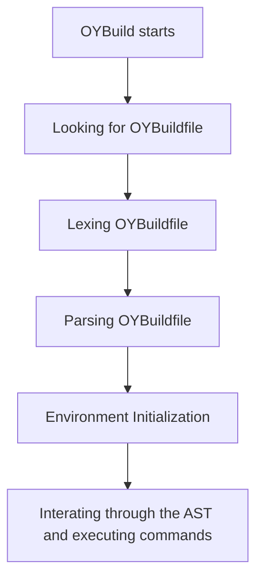

# OYBuild --- OYDVAT build system

# 1. Base syntax
## 1.01: Variables and lists
Variables can be used to store lists \
Example:
```
SOURCES = ["main.c"]
```
With variable expansion:
```
SOURCE = ["setup.c"]
SOURCES = [SOURCE, "main.c"]
```
## 1.02: compile()
Usage:
```
compile(file, [flags])
```
Compiles a C file \
Example:
```
compile("main.c")
```
With variable expansion:
```
FLAGS = ["-Wnull-dereference"]
compile("main.c", FLAGS)
```
With flags:
```
compile("main.c", ["-Iinclude"])
```
## 1.03: Loops
The for keyword is used for loops \
The endfor keyword is used for ending loop \
Example:
```
SOURCES = ["main.c", "util.c", "math.c"]

for (file in SOURCES) do
    compile(file)
endfor
```
## 1.04: cxxcompile()
Compiles a C++ file
## 1.05: link()
Usage:
```
link(output, [objs/flags])
```
Links a C executable \
Example:
```
compile("main.c")
link("a.out", "main.o")
```
## 1.06: cxxlink()
Links a C++ executable
## 1.07: static_lib(), cxxstatic_lib(), shared_lib() and cxxshared_lib()
Creates a library
## 1.08: PkgConfig()
Usage: 
```
PkgConfig(var, package)
```
Runs pkg-config and saves flags to var.
## 1.09: subdirectory()
Usage:
```
subdirectory(path)
```
Enters a subdirectory and runs its OYBuildfile
## 1.10: command()
Runs a command
## 1.11: valacompile()
> [!WARNING]
> This command is only available once OYBuild is rebuilt with \
> the bootstrapped OYBuild. THE BOOTSTRAPPED OYBUILD DOES \
> NOT HAVE THIS COMMAND.

> [!TIP]
> The bootstrapped OYBuild is the one compiled with build.sh \
> The rebuilt OYBuild is the one compiled with bootstrapped one

Compiles a Vala file \
Usage:
```
valacompile(source_file, [flags])
```

# 2. Compiling flow

